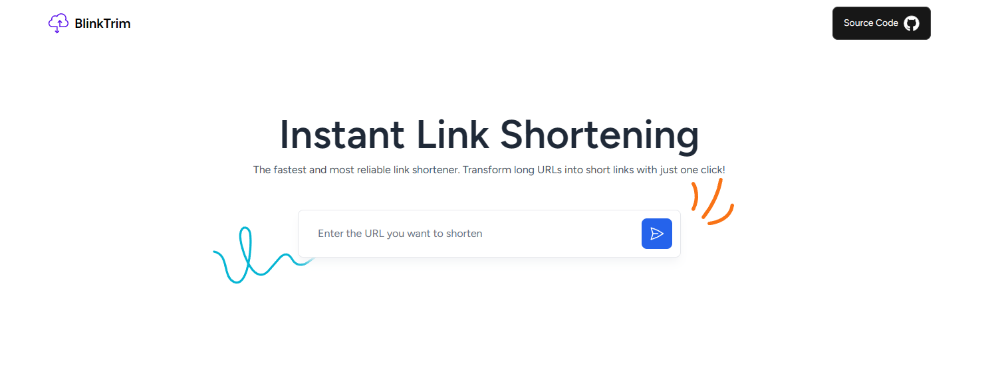

# BlinkTrim

BlinkTrim is an open-source link shortener developed with Laravel and Tailwind CSS. It allows you to quickly and easily transform long URLs into short links.

## Technologies Used

- **Laravel:** This project is developed using the PHP Laravel framework, ensuring a robust and secure backend.

- **Tailwind CSS:** The BlinkTrim user interface is built using Tailwind CSS, a utility-first CSS framework that makes it easy to create flexible and customizable layouts.

## License

This project is licensed under the [GNU General Public License (GPL-3.0)](https://opensource.org/licenses/GPL-3.0), which means you can use, modify, and distribute this software according to the terms of the license.

## Donations

If you like this project and want to support its development, consider buying us a coffee!

